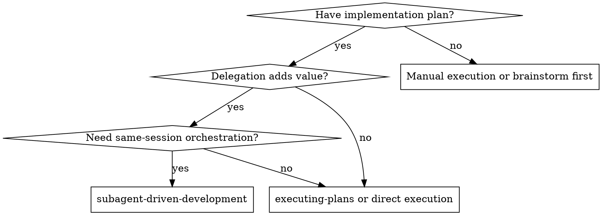
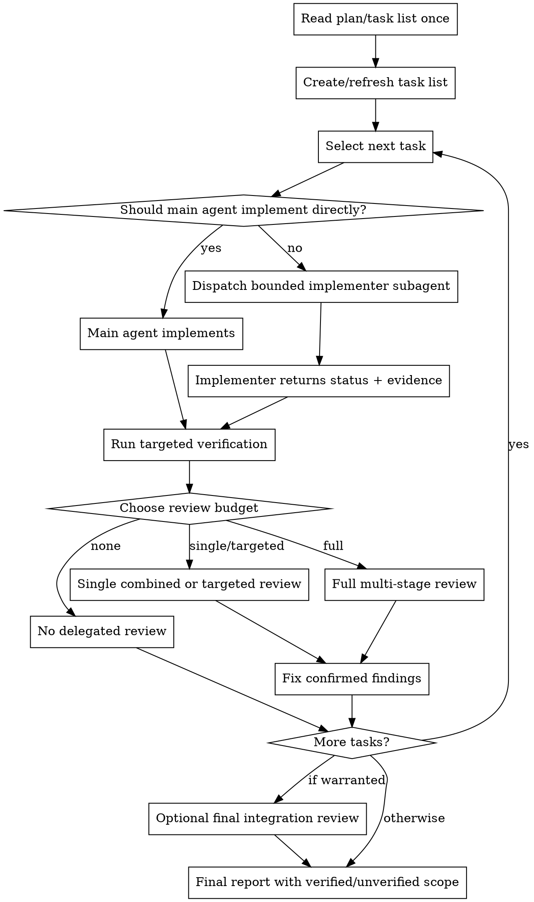

# Subagent-Driven Development

Execute implementation plans by dispatching fresh subagents only where they improve speed, focus, isolation, or review quality. Use review budget deliberately: review is evidence, not ceremony.

**Why subagents:** You delegate bounded work to agents with isolated context. Precisely crafted prompts keep them focused and preserve the main session for routing, synthesis, and user communication.

**Core principle:** Main agent owns routing and final claims. Subagents are escalation tools, not a default swarm.

**Continuous execution:** Do not pause to ask whether to continue once the user approved execution. Continue until blocked, ambiguity genuinely prevents safe progress, or all tasks are complete.

## When to Use

Use this skill when all are true:

1. There is an implementation plan or a clear task list.
2. Work has independent tasks, broad reading, noisy verification, or specialist review needs.
3. Delegation saves meaningful time/context or improves quality enough to justify the cost.

Do **not** use this skill for small, localized, low-risk work where the main agent can implement and verify directly.



## Review Budget

Pick the smallest review budget that fits the risk. Do not run multiple review passes unless each pass has a distinct purpose not already covered.

| Budget | Use when | Review action |
|---|---|---|
| `none` | Low-risk, localized work; Coding Assistant `minimal`/`pragmatic`; good targeted checks exist | Main-agent self-review + targeted verification + explicit verified/unverified handoff |
| `single-combined-review` | Medium-risk behavior change, moderate diff, uncertainty about requirements or quality | One reviewer checks requirement fit, correctness, tests/docs, and overengineering |
| `targeted-specialist-review` | Specific risk area: security, performance, API contract, data migration, UI accessibility | One specialist reviewer for that risk; do not also run generic review unless needed |
| `full-multi-stage-review` | High-risk/core/security-sensitive work, many independent tasks, or user explicitly asks for full process | Spec/acceptance review and quality/security review may be separate |

**Final review is conditional.** Run a final integration review only when there were multiple independent task streams, high-risk/core changes, or prior reviews were narrow. If one combined review already covered the entire change, do not review the same scope again.

## The Process



## Model Selection

Use the least powerful model that can safely handle the role.

| Work | Suggested model tier |
|---|---|
| Simple summaries, narrow doc lookup, checklist verification | Fast/cheap model, e.g. Haiku tier |
| Bounded implementation, focused review, moderate investigation | Standard model, e.g. Sonnet tier |
| Architecture, ambiguous synthesis, high-risk review | Main-agent tier / strongest available |

Prefer one capable reviewer over several weak duplicate reviewers.

## Handling Implementer Status

Implementer subagents report one of four statuses:

**DONE:** Proceed to verification and the selected review budget.

**DONE_WITH_CONCERNS:** Read the concerns. If they affect correctness/scope, resolve them before completion. If they are observations, note them in the final handoff.

**NEEDS_CONTEXT:** Provide missing context and re-dispatch with a narrower prompt.

**BLOCKED:** Change something before retrying: add context, use a stronger model, split the task, or escalate to the human if the plan is wrong.

Never force the same blocked prompt to retry unchanged.

## Prompt Templates

- `./implementer-prompt.md` - Dispatch implementer subagent.
- `./spec-reviewer-prompt.md` - Use only for `full-multi-stage-review` or explicit acceptance/spec risk.
- `./code-quality-reviewer-prompt.md` - Use for combined quality review, targeted quality review, or full review budgets.

## Example: Pragmatic Coding Assistant

```
Task: Update docs and a small installer helper.

1. Main agent reads the relevant task list.
2. Main agent edits directly because the change is localized.
3. Run targeted tests and link checks.
4. Review budget = none or single-combined-review.
5. Final report says:
   - verified: targeted tests, link check
   - not verified: full e2e install on every OS
   - user review: docs wording and release notes
```

## Example: High-Risk Multi-Task Work

```
Task: Add auth-sensitive fullstack feature with API contract changes.

1. Main agent locks contract and task list.
2. Dispatch bounded backend and frontend implementers after contract approval.
3. Run tests for each surface.
4. Review budget = targeted-specialist-review or full-multi-stage-review:
   - API/security reviewer checks authz and data exposure.
   - UI reviewer checks accessibility if UI changed.
5. Final integration review checks only cross-task seams not already reviewed.
```

## Red Flags

**Never:**
- Spawn subagents just because a skill exists.
- Run spec review, quality review, and final review over the same scope without a distinct purpose for each.
- Dispatch multiple implementation subagents that edit overlapping files without isolation.
- Make a subagent read the whole plan when you can provide the exact task and relevant links.
- Ignore subagent questions or blockers.
- Proceed with unresolved Critical findings.
- Claim completion without verification evidence.

**If a reviewer finds issues:**
- Fix Critical and Important findings before proceeding.
- Re-review only the fix or the disputed finding, not the entire change, unless the fix expanded scope.
- Push back on incorrect findings with evidence.

## Phase Boundary

When all independent implementation streams complete and integration review is warranted, invoke `phase-handoff` to capture the integration state before moving to QA or handover. This is optional for single-stream low-risk work but required for Standard/Full paths with multiple independent tracks.

## Integration

Useful companion skills:
- **superpowers:writing-plans** - Creates the plan this skill may execute.
- **superpowers:requesting-code-review** - Provides a reviewer prompt when review budget calls for it.
- **superpowers:verification-before-completion** - Ensures final claims match evidence.
- **superpowers:using-git-worktrees** - Use when parallel agents may conflict or the user requests isolation.
- **superpowers:finishing-a-development-branch** - Use when finishing branch/MR work.
- **phase-handoff** - Invoke at the implementation → review boundary after all streams complete.

Subagents may use **superpowers:test-driven-development** when the selected workflow requires tests-first development or the task is a bugfix/behavior change.

Alternative workflow:
- **superpowers:executing-plans** - Use when direct inline execution with checkpoints is more efficient than subagent orchestration.
